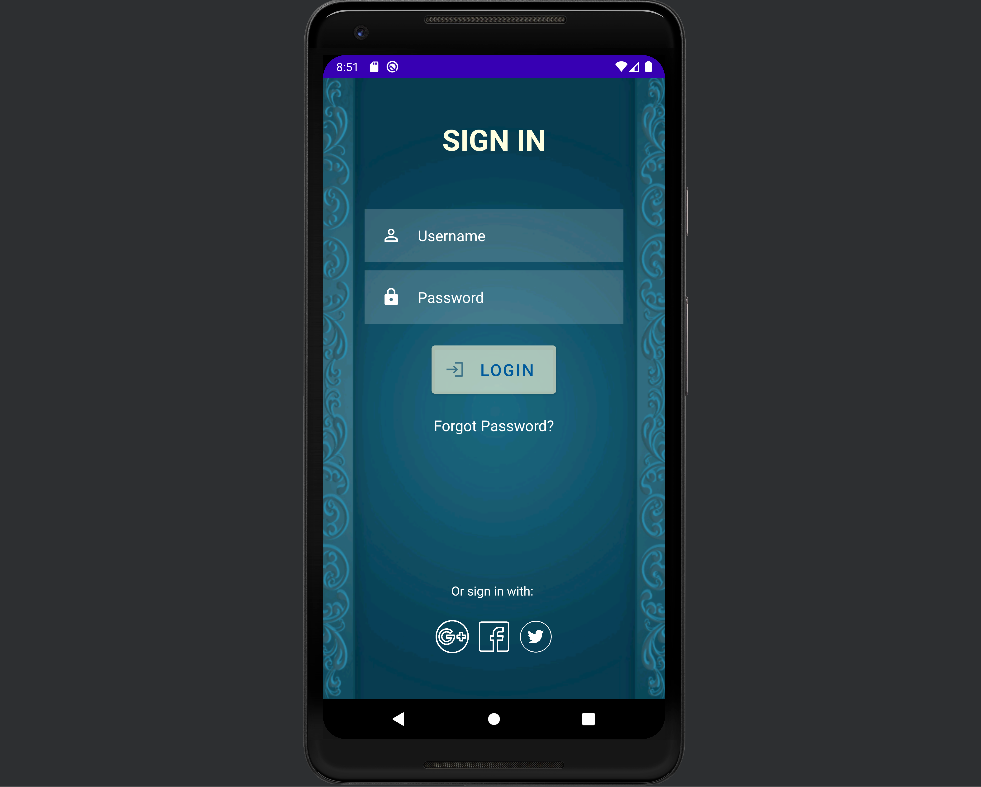

# LoginApplication
This project is an Android login application that allows users to enter their username and password and log in to the app. The user interface is created using XML layout files and the app logic is implemented using Java programming language.

# Files

`MainActivity.java`: This file contains the Java code for the main activity of the application, including the logic for validating the user's input and displaying the appropriate message.

`activity_main.xml`: This file contains the layout for the main activity of the application, including the design for the login screen, with the username and password fields, and the login button. It also includes the design for the social media icons at the bottom of the screen.

# How to use

Open the project in Android Studio.

Run the application on an emulator.

Enter username(admin) and password(admin) and click on the login button.

If the credentials are correct, a success message will be displayed. Otherwise, a failure message will be displayed.
